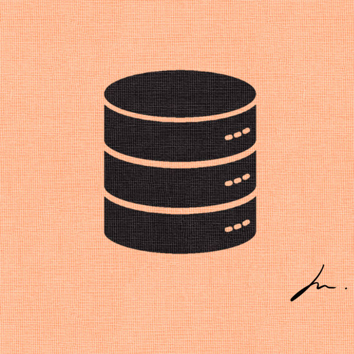

<a name="readme-top"></a>


<br />
<div align="center">
  <a href="https://blog.hyeonmin.com/category/%EB%8D%B0%EC%9D%B4%ED%84%B0%EB%B2%A0%EC%9D%B4%EC%8A%A4/%EC%9E%85%EB%AC%B8">
    
  </a>

  <h3 align="center">데이터베이스 설계 입문</h3>

  <p align="center">
    데이터베이스를 처음부터 설계 및 구현해보는 수업입니다.
  </p>
</div>

## 목적
- 데이터베이스 시스템을 직접 설계 및 구현해보기
- 데이터베이스가 왜 필요한지 직접 체감하기
- 시간복잡도/공간복잡도를 고려한 프로그래밍
- 시스템 구현에 활용되는 핵심 아이디어 및 트릭 학습
- MySQL과 Postgres와 같은 DBMS의 원리 학습

## 챕터
### 0. fileio
데이터베이스 구현에 필요한 file I/O API를 학습합니다.
### 1. db inmemory
Inmemory CRUD를 구현합니다.
### 2. db ondisk
Ondisk CRUD를 구현합니다.
### 3. log basic
로그를 활용한 데이터베이스를 구현합니다.
### 4. log structured
정형화된 로그를 활용한 데이터베이스를 구현합니다.

## 실행 방법
```bash
cd code
python 0_fileio.py
```